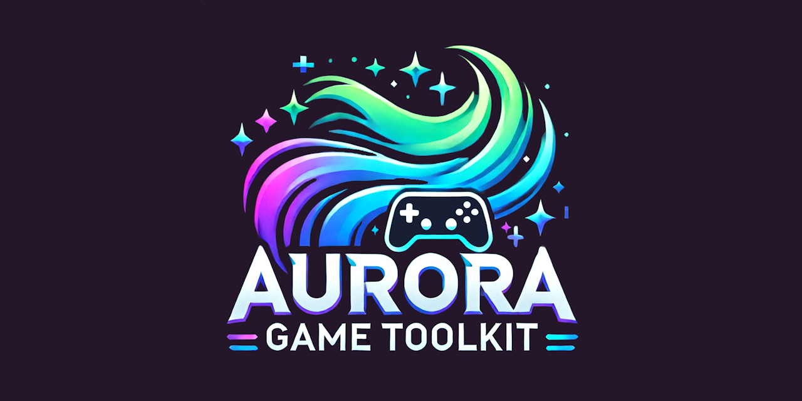

  

### 🚀 Aurora Game Toolkit (AGT): A Powerful Tool for Game Development

The **Aurora Game Toolkit (AGT)** is the ultimate game development powerhouse, blending **cutting-edge functionality** with **intuitive simplicity**. Created in **Delphi**, AGT’s **modular and DLL-based architecture** ensures compatibility with any programming language that supports **DLLs** on **Windows 64-bit platforms**. Whether you're using **C++**, **Python**, or any other language that works with **Unicode (UTF-16)**, AGT seamlessly integrates into your development environment. This flexibility means you can use AGT in your preferred language without sacrificing **performance** or **ease of use**.

### 💪 Empowering Developers

AGT empowers developers by offering a **simple, procedural API** that makes complex game development tasks approachable and efficient. Whether you're a seasoned developer or just starting out, AGT provides the foundational features you need out of the box—everything from **window management** and **input handling** to **advanced graphics** and **audio**. With these core capabilities, AGT lets you focus on building the unique aspects of your game while it takes care of the technical heavy lifting.

### 🎮 Graphics & Input Systems

At its core, AGT features a **sophisticated window management system** that makes graphics handling seamless. Forget about struggling with complex display code—AGT smoothly manages **resolution scaling**, **fullscreen transitions**, and **multi-monitor support**. The **input system** is a developer's dream, offering **pixel-perfect mouse tracking**, **responsive keyboard handling**, and **comprehensive gamepad support**, making control creation effortless. What’s truly impressive is how these systems work together in perfect harmony, allowing you to focus on crafting immersive gameplay instead of wrestling with technical details.

### 🖼️ Multimedia Capabilities

AGT's **multimedia capabilities** are where it truly shines. The toolkit’s **texture system** is both powerful and efficient, supporting everything from basic **sprites** to complex **texture atlases** with built-in features for **rotation**, **scaling**, and **color manipulation**. Coupled with an advanced **collision detection system** and smooth **animation capabilities** through easing functions, AGT gives you everything you need to create visually stunning and interactive games. Its **audio engine** provides full **3D spatial audio**, **multiple channel management**, and support for both **music** and **sound effects**—all with the kind of **performance** modern games demand.

### 🧠 Thoughtful Design & Developer Focus

What sets AGT apart is its **thoughtful design** and a relentless focus on **developer experience**. The powerful **console system**, complete with **rich text formatting** and **color support**, makes **debugging** and development a breeze. The **I/O system** shines with seamless integration of **ZIP archives**, making **asset management** and **game distribution** simpler and more efficient. Each feature is meticulously documented and designed for real-world use, making AGT accessible for newcomers while offering the depth that experienced developers expect.

### 🔧 Advanced Features for Complex Challenges

AGT doesn’t just make game development easier—it offers elegant solutions to complex challenges. Whether you need advanced **vector operations**, precise **collision detection**, or intuitive **sprite** and **animation handling**, AGT’s built-in mathematics and texture management systems deliver. The **modular design** allows you to pick and choose the features you need, whether you’re working on a simple **2D project** or a full **3D game**.

### 🧘‍♂️ Simplicity & Flexibility

AGT is designed for **simplicity** and **flexibility**, providing you with the essential building blocks for game development that can be easily extended and customized to fit your needs. The framework’s clean design means you can build on top of these foundational features, layering in your own unique systems to create the game you envision.

### 💻 Built for Modern Development

Designed specifically for **Windows 64-bit platforms** and written in **Pascal/Delphi**, AGT combines the power of native code with the **clarity** and **maintainability** that Pascal is renowned for. **Modern**, **capable**, and **efficient**, AGT is built to tackle any creative challenge. Whether you're a solo developer crafting your first game or part of a team working on the next big hit, the **Aurora Game Toolkit** provides the advanced features and reliable foundation you need to make your **game development dreams** a reality.

With **AGT**, your **imagination** is the only limit.

### 🚀 **How to Get Started with AGT**

Getting started with AGT is easy! Follow these simple steps:

1. **Download the AGT repository** from [GitHub](https://github.com/tinyBigGAMES/AGT/archive/refs/heads/main.zip)
2. **Unzip** the downloaded file to your desired location
3. **Add** `AGT` from `lib` folder to the `uses` section of your project
4. **Include AGT.dll** in your project distribution for it to work correctly
5. For detailed examples, check out the **examples folder** to see AGT in action
6. **Created and tested** using **RAD Studio 12.2** on **Windows 11 (24H2)**

AGT should be compatible with any programming language with bindings that **support** **DLL usage**, **Windows 64-bit** architecture, and **Unicode**.

---

The **Aurora Game Toolkit (AGT)** is a **work-in-progress**, and we’re actively developing and improving it to bring you the best 2D game development experience! 🚀 The repository’s README is currently under construction 🛠️, but we’re here to help if you need assistance.  

Feel free to:  
- 💬 [**Join our Discord**](https://discord.gg/tPWjMwK) for live discussions and support.  
- 📝 [**Post in Discussions**](https://github.com/tinyBigGAMES/AGT/discussions) for questions or suggestions.  
- 🐞 [**Submit an Issue**](https://github.com/tinyBigGAMES/AGT/issues) if you encounter any bugs or need help with specific problems.  

We appreciate your patience and feedback as we continue to build something awesome together! 🎮🔥

<h5 align="center">

Made with :heart: in Delphi
</h5>

